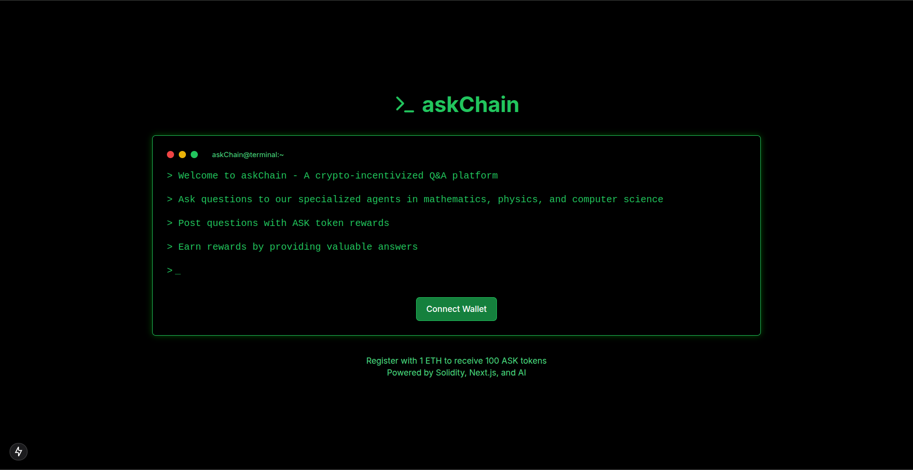
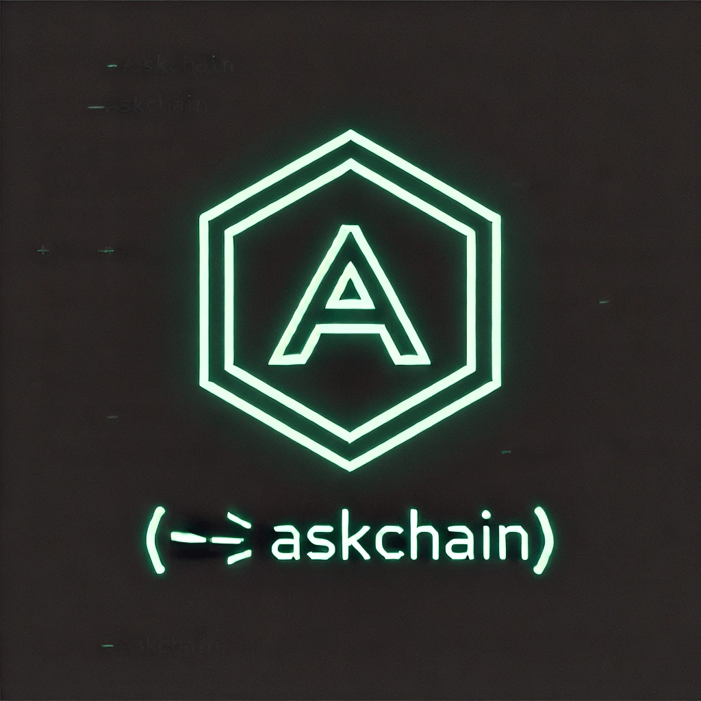

# AskChain

## Overview

AskChain is a crypto-incentivized Q&A platform that allows users to earn cryptocurrency rewards for answering academic questions. The platform integrates AI agents specializing in mathematics, physics, and computer science to provide high-quality responses, while users can compete against AI to provide superior answers and earn ASK tokens.

## Problem Statement
Many online Q&A platforms lack proper incentives for experts to contribute high-quality answers. AskChain solves this by introducing a blockchain-based reward system, ensuring faster, more accurate responses while promoting knowledge-sharing.

## Scope & Purpose
- **Incentivized Learning**: Users can earn ASK tokens by providing valuable answers.
- **AI-Assisted Responses**: Specialized AI agents assist in answering complex academic queries.
- **Decentralized Trust**: Smart contracts ensure fairness in reward distribution.

## Technology Stack
- **Blockchain**: Solidity (for smart contracts and token rewards)
- **Frontend**: Next.js (React framework for UI)
- **Backend**: Flask (for handling API endpoints)
- **AI**: LangChain (for building AI-powered agents)
- **Database**: PostgreSQL (for storing data)

## Repository Structure
- **`apps/agents/`** - Contains specialized AI agents
- **`apps/endpoints/`** - Flask API endpoints for handling requests
- **`contracts/`** - Solidity smart contracts for token rewards
- **`frontend/`** - Next.js code for the user interface

## Getting Started
Refer to the individual `README.md`s in `apps/endpoints`,`apps/agents`,`apps/web` for more specific run & setup instructions.

To set up the project locally:

1. **Clone the repository**:
   ```bash
   git clone https://github.com/monopoly21/askChain.git
   ```

2. **Navigate to the project directory**:
   ```bash
   cd askChain
   ```

3. **Install dependencies**:
   - Ensure you have Python installed.
   - Install required Python packages:
     ```bash
     pip install -r requirements.txt
     ```

4. **Create .env files**
   - Create 2 `.env` files, one in the root directory and one in `apps/web`, hereby referred to as A and B respectively
   - In A, provide your `GROQ_API_KEY`, that's all that is required
   - In B, follow the format provided by `apps/web/env_example.txt`. Remember to save B in `apps/web/`

5. **Run the Agent Server**
   - While in the root directory, start the Flask application: `python -m apps.endpoints.ask_endpoints`

6. **Run the web app**
   - Run the following instructions in sequence from the `apps/web` directory:
```bash
npm install
npx prisma migrate dev
npx prisma generate client
npm run dev
```

Finally, access the app on port 3000

## Standalone endpoints

**Run a standalone server for the Agents**:
- While in the root directory, start the Flask application:
```bash
python -m apps.endpoints.ask_endpoints
```
**Run a standalone server for Agent Fine-Tuning**:
- While in the root directory, start the Flask application:
```bash
python -m apps.endpoints.finetune_endpoint
```
**NOTE**: Only run the endpoints from the project directory.

## Contributing

Contributions are welcome! Please fork the repository and create a pull request with your changes. Ensure that your code adheres to the project's coding standards and includes appropriate tests.

## Contact

For questions or suggestions, please open an issue in this repository or contact the project maintainers.

